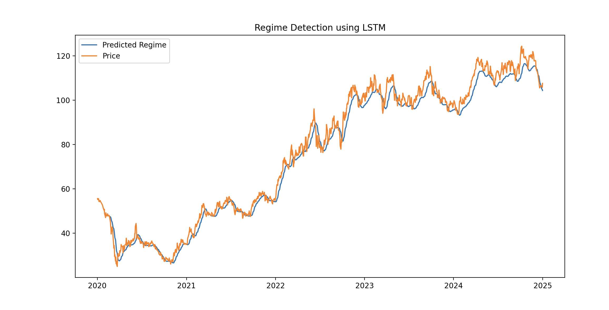
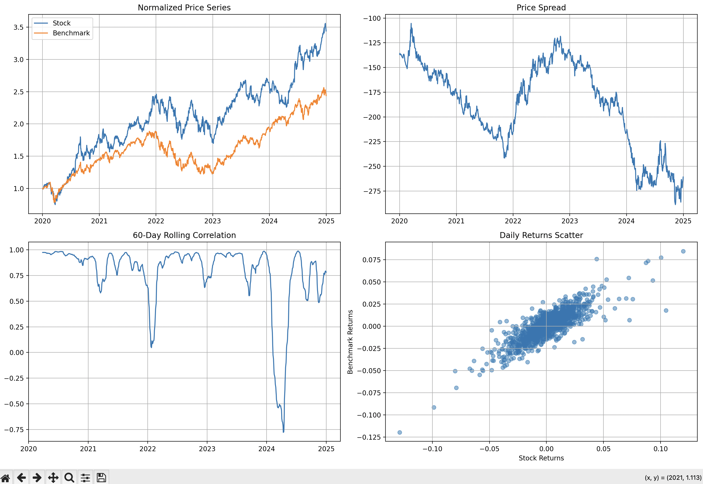
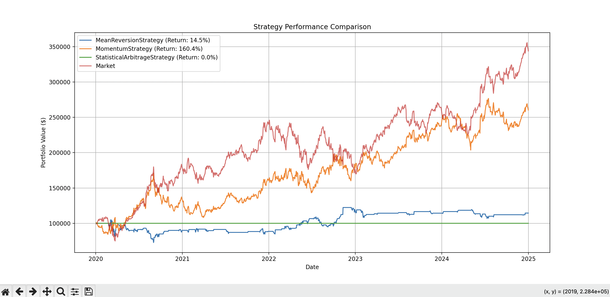

# Quantitative Trading Engine

A comprehensive Python-based trading engine that allows you to backtest multiple trading strategies using historical market data. The engine combines traditional technical analysis strategies like momentum and mean reversion with more sophisticated approaches like statistical arbitrage and portfolio optimization.

Key capabilities include:
- Backtesting multiple strategies simultaneously on any stock or ETF available through Yahoo Finance
- Analyzing risk metrics including Value at Risk (VaR), drawdown statistics, and factor exposures
- Visualizing strategy performance with detailed charts and statistical analysis
- Managing market data efficiently through local caching and multiple data provider options
- Implementing complex trading logic with built-in statistical tests and position sizing

This project is designed for:
- Quantitative researchers testing trading hypotheses
- Traders looking to evaluate strategy performance
- Developers interested in building robust financial software
- Students learning about quantitative finance and algorithmic trading

The engine supports three main trading strategies:
1. Momentum: Exploits trending behavior in price movements
2. Mean Reversion: Capitalizes on price deviations from historical averages
3. Statistical Arbitrage: Implements pairs trading using cointegration and statistical tests

All components are built with a focus on code quality, testing, and extensibility, making it easy to add new strategies or enhance existing functionality.

## Core Features

### Advanced Trading Strategies
- **Statistical Arbitrage:** Implements pairs trading with dynamic hedge ratios and cointegration testing
- **Mean Reversion:** Adaptive thresholds with position sizing
- **Momentum:** Trend-following with optimized lookback periods
- **Portfolio Optimization:** Modern portfolio theory implementation with custom constraints

### Sophisticated Analytics
- **Advanced Risk Metrics:** 
  - Value at Risk (VaR) with multiple calculation methods
  - Conditional VaR (Expected Shortfall)
  - Extreme Value Theory (EVT) for tail risk
  - Dynamic drawdown analysis with recovery metrics
- **Factor Analysis:**
  - Multi-factor exposure calculation
  - Dynamic beta estimation
  - R-squared analytics
- **Statistical Tests:**
  - Cointegration testing with ADF
  - Half-life calculation for mean reversion
  - Rolling correlation analysis

### Enhanced Visualization
- **Interactive Performance Dashboards:**
  - Strategy return comparisons
  - Risk metric visualization
  - Drawdown analysis
- **Pair Trading Analytics:**
  - Spread visualization
  - Rolling correlation plots
  - Returns scatter analysis
  - Normalized price series comparison

### Technical Architecture
- **Robust Data Management:**
  - SQLite-based market data caching
  - Multiple data provider support (Yahoo Finance, CSV)
  - Efficient data preprocessing and alignment
- **Concurrent Processing:**
  - Parallel strategy backtesting
  - Thread-safe data handling
  - Optimized computation engine
- **Production-Ready Features:**
  - Comprehensive logging system
  - Performance profiling decorators
  - Error handling and recovery
  - Modular, extensible design

## Installation

### Prerequisites
- Python 3.8+
- pip package manager
- Virtual environment (recommended)

### Step 1: Clone the Repository
```bash
git clone https://github.com/ryannapp12/quant_trading_engine.git
cd quant_trading_project
```

### Step 2: Set Up Virtual Environment
```bash
# Create virtual environment
python -m venv venv

# Activate virtual environment
# Windows:
venv\Scripts\activate
# macOS/Linux:
source venv/bin/activate
```

### Step 3: Install Dependencies
```bash
pip install -r requirements.txt
```

### Step 4: Environment Configuration
Create a `.env` file in the root directory with the following variables:
```env
# Default Settings
DEFAULT_TICKER=XOM
DEFAULT_BENCHMARK_TICKER=CVX
DEFAULT_START_DATE=2020-01-01
DEFAULT_END_DATE=2025-01-01
INITIAL_CAPITAL=1000000.0

# Data Settings
DB_PATH=data/market_data.db
DATA_PROVIDER=yahoo
CSV_FILE_PATH=data/XOM.csv

# Alpaca API Configuration
ALPACA_API_KEY_LIVE=your_live_key
ALPACA_API_SECRET_LIVE=your_live_secret
ALPACA_API_KEY_TEST=your_test_key
ALPACA_API_SECRET_TEST=your_test_secret
ALPACA_BASE_URL_TEST=https://paper-api.alpaca.markets/v2
ALPACA_BASE_URL_LIVE=https://api.alpaca.markets

# Dashboard Configuration
DASHBOARD_UPDATE_INTERVAL_MS=60000
```

## Usage

### Running Backtests
```bash
# Run default backtest
python main.py

# Run with ML regime detection
python main.py --mode ml
```

### Starting the Live Dashboard
```bash
# Start the real-time dashboard
python src/dashboard.py
```

## Strategy Configuration

### Momentum Strategy
```python
STRATEGY_CONFIG = {
    'momentum': {
        'window': 20
    }
}
```

### Mean Reversion Strategy
```python
STRATEGY_CONFIG = {
    'mean_reversion': {
        'window': 20,
        'threshold': 0.05
    }
}
```

### Statistical Arbitrage Strategy
```python
STRATEGY_CONFIG = {
    'statistical_arbitrage': {
        'lookback_period': 60,
        'entry_zscore': 2.0,
        'exit_zscore': 0.5,
        'max_position_hold': 20,
        'min_half_life': 5,
        'confidence_level': 0.05
    }
}
```

## Project Structure
```
quant_trading_project/
├── config/
│   └── settings.py              # Configuration parameters
├── data/
│   └── market_data.db          # SQLite database (auto-generated)
├── src/
│   ├── core/
│   │   ├── backtesting_engine.py    # Parallel backtesting engine
│   │   ├── data_provider.py         # Data provider interface
│   │   ├── portfolio_optimizer.py    # Portfolio optimization
│   │   ├── real_time_data.py        # Live data processing
│   │   ├── risk_engine.py           # Risk analytics
│   │   └── models.py                # Data models
│   ├── strategies/
│   │   ├── base_strategy.py         # Strategy interface
│   │   ├── momentum_strategy.py     # Momentum implementation
│   │   ├── mean_reversion_strategy.py # Mean reversion
│   │   └── statistical_arbitrage.py  # Stat arb implementation
│   └── utils/
│       ├── logger.py                # Logging configuration
│       └── decorators.py            # Performance monitoring
├── dashboard.py                # Real-time dashboard
├── main.py                     # Application entry point
├── requirements.txt            # Dependencies
└── README.md                   # This file
```

### ML-Based Regime Detection


The LSTM-based regime detection visualization shows:
- Price movements of the asset (orange line)
- Predicted market regime by the LSTM model (blue line)
- Clear regime changes and transitions from 2020 to 2025
- Model's ability to track both trend and mean-reversion regimes

### Real-Time Performance Tracking


The real-time dashboard displays:
- Live strategy performance vs market benchmark
- Minute-by-minute portfolio value updates
- Performance tracking starting from January 1, 2025
- Clear visualization of strategy outperformance and drawdowns

### Pair Trading Analysis


The above visualization shows:
- Normalized price series comparing the stock vs benchmark
- Price spread between the pairs
- 60-day rolling correlation
- Daily returns scatter analysis

### Strategy Performance


The performance comparison shows:
- MeanReversionStrategy (Return: 14.5%)
- MomentumStrategy (Return: 160.4%)
- StatisticalArbitrageStrategy (Return: 0.0%)
- Market performance as benchmark

### Example Console Output
```bash
(.venv) ryannapolitano@Ryans-MacBook-Pro quant_trading_project % python3 main.py --mode backtest
2025-02-09 14:35:34,865 - __main__ - INFO - Data loaded for XOM
[*********************100%***********************]  1 of 1 completed
2025-02-09 14:35:35.814 Python[21623:156389162] +[IMKClient subclass]: chose IMKClient_Modern
2025-02-09 14:35:35.814 Python[21623:156389162] +[IMKInputSession subclass]: chose IMKInputSession_Modern
ADF p-value: 0.18048318811014707
Cointegration Test Passed: False
2025-02-09 14:35:40,173 - __main__ - INFO - Backtesting completed.
2025-02-09 14:35:40,191 - __main__ - INFO - 
MeanReversionStrategy Analysis:
2025-02-09 14:35:40,191 - __main__ - INFO - Tail Risk Metrics:
2025-02-09 14:35:40,191 - __main__ - INFO - - historical_var: -2.35%
2025-02-09 14:35:40,191 - __main__ - INFO - - parametric_var: -2.59%
2025-02-09 14:35:40,191 - __main__ - INFO - - conditional_var: -4.36%
2025-02-09 14:35:40,191 - __main__ - INFO - - evt_var: -0.12%
2025-02-09 14:35:40,191 - __main__ - INFO - 
Drawdown Analysis:
2025-02-09 14:35:40,191 - __main__ - INFO - - max_drawdown: -56.55%
2025-02-09 14:35:40,191 - __main__ - INFO - - average_drawdown: -43.45%
2025-02-09 14:35:40,191 - __main__ - INFO - - average_recovery_time: 2.0 days
2025-02-09 14:35:40,191 - __main__ - INFO - - drawdown_frequency: 0.08%
2025-02-09 14:35:40,219 - __main__ - INFO - 
MomentumStrategy Analysis:
2025-02-09 14:35:40,219 - __main__ - INFO - Tail Risk Metrics:
2025-02-09 14:35:40,219 - __main__ - INFO - - historical_var: -3.25%
2025-02-09 14:35:40,219 - __main__ - INFO - - parametric_var: -3.53%
2025-02-09 14:35:40,219 - __main__ - INFO - - conditional_var: -4.82%
2025-02-09 14:35:40,219 - __main__ - INFO - - evt_var: -0.09%
2025-02-09 14:35:40,219 - __main__ - INFO - 
Drawdown Analysis:
2025-02-09 14:35:40,219 - __main__ - INFO - - max_drawdown: -47.48%
2025-02-09 14:35:40,219 - __main__ - INFO - - average_drawdown: -34.41%
2025-02-09 14:35:40,219 - __main__ - INFO - - average_recovery_time: 3.8 days
2025-02-09 14:35:40,219 - __main__ - INFO - - drawdown_frequency: 0.79%
2025-02-09 14:35:40,220 - __main__ - INFO - 
StatisticalArbitrageStrategy Analysis:
2025-02-09 14:35:40,220 - __main__ - INFO - Tail Risk Metrics:
2025-02-09 14:35:40,220 - __main__ - INFO - - historical_var: 0.00%
2025-02-09 14:35:40,220 - __main__ - INFO - - parametric_var: 0.00%
2025-02-09 14:35:40,220 - __main__ - INFO - - conditional_var: 0.00%
2025-02-09 14:35:40,220 - __main__ - INFO - - evt_var: 0.00%
2025-02-09 14:35:40,220 - __main__ - INFO - 
Drawdown Analysis:
2025-02-09 14:35:40,220 - __main__ - INFO - - max_drawdown: 0.00%
2025-02-09 14:35:40,220 - __main__ - INFO - - average_drawdown: 0.00%
2025-02-09 14:35:40,220 - __main__ - INFO - - average_recovery_time: 0.0 days
2025-02-09 14:35:40,220 - __main__ - INFO - - drawdown_frequency: 0.00%
(.venv) ryannapolitano@Ryans-MacBook-Pro quant_trading_project % python3 main.py --mode ml      
[*********************100%***********************]  1 of 1 completed
Epoch 1/10
39/39 ━━━━━━━━━━━━━━━━━━━━ 1s 6ms/step - loss: 0.1133   
Epoch 2/10
39/39 ━━━━━━━━━━━━━━━━━━━━ 0s 5ms/step - loss: 0.0056 
Epoch 3/10
39/39 ━━━━━━━━━━━━━━━━━━━━ 0s 6ms/step - loss: 0.0048 
Epoch 4/10
39/39 ━━━━━━━━━━━━━━━━━━━━ 0s 6ms/step - loss: 0.0043 
Epoch 5/10
39/39 ━━━━━━━━━━━━━━━━━━━━ 0s 6ms/step - loss: 0.0045 
Epoch 6/10
39/39 ━━━━━━━━━━━━━━━━━━━━ 0s 6ms/step - loss: 0.0043 
Epoch 7/10
39/39 ━━━━━━━━━━━━━━━━━━━━ 0s 6ms/step - loss: 0.0037 
Epoch 8/10
39/39 ━━━━━━━━━━━━━━━━━━━━ 0s 6ms/step - loss: 0.0047 
Epoch 9/10
39/39 ━━━━━━━━━━━━━━━━━━━━ 0s 6ms/step - loss: 0.0036 
Epoch 10/10
39/39 ━━━━━━━━━━━━━━━━━━━━ 0s 6ms/step - loss: 0.0035 
39/39 ━━━━━━━━━━━━━━━━━━━━ 0s 3ms/step 
2025-02-09 14:38:40.106 Python[22256:156397321] +[IMKClient subclass]: chose IMKClient_Modern
2025-02-09 14:38:40.106 Python[22256:156397321] +[IMKInputSession subclass]: chose IMKInputSession_Modern
```

## Advanced Usage

### Custom Strategy Implementation
```python
from src.strategies.base_strategy import BaseStrategy

class CustomStrategy(BaseStrategy):
    def __init__(self, params):
        self.params = params
        
    def generate_signals(self, data):
        # Implement signal generation logic
        return signals
```

### Portfolio Optimization
```python
from src.core.portfolio_optimizer import PortfolioOptimizer

optimizer = PortfolioOptimizer(
    returns=returns_data,
    risk_free_rate=0.02,
    constraints={'max_weight': 0.3}
)
optimal_portfolio = optimizer.optimize_sharpe()
```

### Risk Analysis
```python
from src.core.risk_engine import RiskEngine

risk_engine = RiskEngine(strategy_results)
risk_metrics = risk_engine.calculate_tail_risk_metrics()
drawdown_metrics = risk_engine.calculate_drawdown_metrics()
```

## Contributing

1. Fork the repository
2. Create your feature branch (`git checkout -b feature/SickFeature`)
3. Commit your changes (`git commit -m 'Add some SickFeature'`)
4. Push to the branch (`git push origin feature/SickFeature`)
5. Open a Pull Request

## Documentation
- The code includes comprehensive docstrings and type hints
- Each module has detailed documentation of its functionality
- Strategy implementations include theoretical background and references

## Testing
Run the test suite:
```bash
pytest tests/
```

## License
This project is licensed under the MIT License - see the LICENSE file for details.

## Acknowledgments
- Built with yfinance for market data
- Uses Alpaca Markets for live trading
- Dash and Plotly for visualization
- TensorFlow for ML components